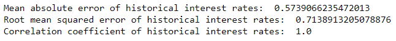

## Simulation of interest rate scenarios of US 10-year treasury yield using the Schöbel-Zhu Hull-White (SZHW) model

#### Name: Sameer Dhoke
#### Date: 04-January-2023

#### Table of Content:
1. Description

2. Theoretical Background and Mathematical Expression of the Schöbel-Zhu Hull-White (SZHW) Model  
2.1 Hull-White model  
2.2 Black-Scholes model  
2.3 Black-Scholes Hull-White model  
2.4 Schöbel-Zhu Hull-White (SZHW) model  
2.5 Exploring the Schöbel-Zhu Hull-White (SZHW) Model as a Hybrid Asset Model

3. Project Structure  
3.1 Directory Structure  
3.2 Why 2 methodologies used in Interest Rate Scenario Generation?

4. Project Details  
4.1 SZHW Model Part A: Framework, Code Implementation and Output Analysis  
4.2 SZHW Model Part B: Framework, Code Implementation and Output Analysis

5. Scope of the Project

6. References

### Description

This project analyzes US 10-year treasury yields using the Schöbel-Zhu Hull-White (SZHW) model. The primary purpose of this project is to develop a simulation model to analyze the impact of different economic scenarios on interest rates and estimate the value of a call option under each scenario. I have divided the project into Part A and Part B.

In Part A, I first gather historical interest rate data and calibrate the SZHW model. Then, I develop a simulation model to generate interest rate scenarios, analyze the simulated results, and estimate the coefficients for each independent variable using a linear regression model. I also evaluate the impact of interest rate scenarios using the Black-Scholes model to estimate the value of a call option.

In Part B, I incorporate the impact of economic indicators into the scenarios and then develop the simulation model to evaluate the effect of interest rate scenarios and estimate the value of a call option under each scenario. I also validate and analyze the performance of the simulation model by comparing the simulated yields with historical yields.

The Schöbel-Zhu Hull-White model is a popular financial model for interest rate derivatives that extends the popular Hull-White model by incorporating the stochastic volatility of the interest rate. This model has several advantages, including being able to produce more realistic yield curves and having the ability to incorporate the impact of various economic indicators on interest rates. The disadvantage is that it can be computationally expensive and may require more data for calibration.

This project aims to provide a comprehensive framework for analyzing US 10-year treasury using the Schöbel-Zhu Hull-White (SZHW) model and to demonstrate how this model can be used to evaluate the impact of various economic scenarios on interest rates and estimate the value of a call option under each scenario.

### Theoretical Background and Mathematical Expression of the Schöbel-Zhu Hull-White (SZHW) Model

##### Description of the Schöbel-Zhu Hull-White (SZHW) Model

* Black-Scholes Hull-White model and Schöbel-Zhu Hull-White (SZHW) model

    The Black-Scholes Hull-White model combines the Black-Scholes option pricing model and the Hull-White interest rate model. It is used to value European options - options that can only be exercised on the expiration date - on underlying assets subject to interest rate changes. The model considers the underlying asset's volatility and the interest rate volatility modeled by the Hull-White model.  
    The Schöbel-Zhu Hull-White (SZHW) model is a more sophisticated extension of the Black-Scholes Hull-White model that accounts for additional factors such as mean reversion and the impact of interest rate volatility on the underlying asset's price. The SZHW model values options on more complex underlying assets, such as bonds and credit derivatives.  
    In both models, the Hull-White interest rate model is used to model the behavior of interest rates over time. This model considers factors such as mean reversion and interest rate volatility, which can significantly impact the value of financial instruments.  
    Both the Black-Scholes Hull-White model and the Schöbel-Zhu Hull-White model are widely used in finance and provide a more accurate representation of the value of financial instruments compared to models that do not take into account interest rate dynamics. These models are helpful for pricing options, bonds, and risk management.

* Mathematical theory behind the Schöbel-Zhu Hull-White (SZHW) model

    The Hull-White interest rate model is at the core of the SZHW model, a widely used term structure model.  

    * Hull-White model describes the evolution of interest rates over time.  
    The Hull-White one-factor model considers the mean reversion property of interest rates and their volatility. The model is based on the following stochastic differential equation (SDE):

        d(r(t)) / dt = θ(t) (θ* - r(t)) + σ dW(t)

        where:  
        r(t) is the short-term interest rate at time t  
        θ(t) is the speed of mean reversion  
        θ* is the long-run mean of the interest rate  
        σ is the volatility of the interest rate. It determines the degree of randomness in the evolution of the interest rate.  
        dW(t) is a standard Brownian motion, which represents a random process with normally distributed increments  

        The Hull-White model assumes that the short-term interest rate follows a mean-reverting process, meaning that the rate will tend to return to its long-run mean (θ*) over time, with speed determined by θ(t).

        The Hull-White model uses stochastic calculus and partial differential equations to model the behavior of interest rates over time. The Hull-White model is widely used in finance to value financial instruments such as bonds and interest rate derivatives. It provides a more accurate representation of the behavior of interest rates compared to models that do not consider mean reversion and interest rate volatility.

    * The Hull-White model makes several assumptions to model the behavior of interest rates over time: 

    1. The interest rate process is deterministic: The Hull-White model assumes that a deterministic differential equation determines the evolution of the interest rate over time.
    2. The interest rate process is mean reverting: The Hull-White model assumes that the interest rate will revert towards a long-term mean level over time, known as mean reversion.
    3. The volatility of the interest rate is constant: The Hull-White model assumes that the volatility of the interest rate is constant over time.
    4. The market is complete: The Hull-White model assumes that we can trade all possible assets and securities, allowing for the absolute replication of any payoffs.
    5. The risk-free rate is constant: The Hull-White model assumes that the risk-free rate is constant over time.
    6. It's important to note that these assumptions are idealized and may not always hold in real-world market conditions.

    * The SZHW model extends the Hull-White model by incorporating additional factors that affect the underlying asset's price, such as mean reversion and the impact of interest rate volatility on the underlying asset's price. The model uses mathematical techniques, such as stochastic calculus and partial differential equations, to model the behavior of interest rates and the underlying asset over time. 

        The mathematical expression for the SZHW model can be represented as follows:

        dS(t)/dt = μS(t)dt + σS(t)dZ(t) + λd(r(t))

        where:
        S(t) is the price of the underlying asset at time t  
        μ is the expected return of the underlying asset  
        σ is the volatility of the underlying asset's price  
        dZ(t) is a standard Brownian motion representing the randomness in the underlying asset's price  
        r(t) is the short-term interest rate at time t  
        λ is the sensitivity of the underlying asset's price to changes in the interest rate  
        d(r(t)) is the change in the interest rate  

    * The Schöbel-Zhu Hull-White (SZHW) model builds upon the assumptions of the Hull-White model and extends it by incorporating additional factors that affect the underlying asset's price. Some of the critical assumptions of the SZHW model include the following:

    1. Mean reversion: Like the Hull-White model, the SZHW model assumes that the interest rate will revert towards a long-term mean level over time.
    2. Interest rate volatility: The SZHW model considers the impact of interest rate volatility on the underlying asset's price. This impact is not captured by the Hull-White model.
    3. Risk-free rate: The SZHW model assumes the risk-free rate is constant over time.
    4. Market efficiency: The SZHW model assumes that the market is efficient and that all available information is immediately reflected in the underlying asset's current price.
    5. European options: The SZHW model uses the Black-Scholes option pricing formula to price European options, assuming that the underlying asset's price follows a lognormal distribution.
    6. It's important to note that these assumptions are idealized and may not always hold in real-world market conditions.

    * The option pricing component of the SZHW model uses the Black-Scholes option pricing formula, a widely used model for pricing European options. The Black-Scholes formula considers the underlying asset's price, the strike price, the time to expiration, the volatility of the underlying asset, and the risk-free interest rate.

        The Black-Scholes formula for the price of a European call option is given by:

        C(S,t) = SN(d1) - Ke^{-r(T-t)}N(d2)

        where:  
        C(S,t) is the call option price at time t for a underlying asset with price S  
        S is the current price of the underlying asset  
        K is the strike price of the option  
        r is the risk-free interest rate  
        T is the time to expiration of the option  

        N(d1) and N(d2) are cumulative standard normal distributions, given by:

        d1 = (ln(S/K) + (r + σ^2/2)(T-t))/(σ√(T-t))

        d2 = d1 - σ√(T-t)

        and where:  
        σ is the volatility of the underlying asset's price  

        The Black-Scholes formula for the price of a European put option is given by:

        P(S,t) = Ke^{-r(T-t)}N(-d2) - SN(-d1)

        where:  
        N(-d1) and N(-d2) are cumulative standard normal distributions with negative arguments.

    * The Black-Scholes model makes several assumptions to determine the price of a European option:
    1. The underlying asset's price follows a lognormal distribution: This means that the natural logarithm of the underlying asset's price is normally distributed over time.
    2. There is no dividend yield: The Black-Scholes model assumes that the underlying asset does not pay any dividends.
    3. The market is efficient: The Black-Scholes model assumes that all available information is immediately reflected in the underlying asset's current price.
    4. Trading is frictionless: The Black-Scholes model assumes that there are no transaction costs, taxes, or any other impediments to trading the underlying asset.
    5. The risk-free interest rate is constant: The Black-Scholes model assumes that the risk-free interest rate is constant and known.
    6. Volatility is constant: The Black-Scholes model assumes that the underlying asset's price volatility is constant over time.
    7. There is no arbitrage: The Black-Scholes model assumes no opportunities for risk-free profit (arbitrage).
    8. It's important to note that these assumptions are idealized and may not always hold in real-world market conditions.

    * The mathematical expression for the four parameters of the Schöbel-Zhu Hull-White (SZHW) model is not a simple closed-form equation, as it depends on several factors, including the underlying asset, the strike price, the time to expiration, the volatility of the underlying asset, and the risk-free interest rate. The SZHW model generally involves solving a system of partial differential equations using numerical methods. The four parameters can be estimated using techniques such as maximum likelihood estimation or Bayesian inference.  
    λ - Mean reversion speed parameter - captures the rate at which the interest rate reverts towards its long-term mean.  
    Θ - long-term mean - is the average level of interest rates over a long-time horizon.  
    σ - volatility parameter - captures the level of volatility in the interest rate process.  
    ρ - correlation parameter - captures the degree of association between the interest rate process and the underlying asset.  

#### Exploring the Schöbel-Zhu Hull-White (SZHW) Model as a Hybrid Asset Model

Hybrid asset models, such as the Schöbel-Zhu Hull-White (SZHW) model, can be considered an affine hybrid asset model. These models are helpful for hybrid payoffs that have limited sensitivity to the interest rate smile. However, they are also crucial in risk management, particularly for Credit Valuation Adjustment (CVA). Here the implied volatility smile and the stochastic interest rate may significantly affect the Potential Future Exposure (PFE) quantity.

One can use the Stochastic Differential Equations (SDEs) system to express hybrid models, where each asset class has its SDE with a full correlation matrix. One can define the hybrid models by correlating these SDEs from the different asset classes. Although each of the individual SDEs yields a closed-form solution, a non-zero correlation structure between the processes may cause efficient valuation and calibration difficulties. Typically, a numerical approximation using a Monte Carlo (MC) simulation or discretization of the corresponding PDEs has to be employed to overcome these difficulties.

However, although one can define hybrid models such as the SZHW and the Black-Scholes Hull-White relatively quickly, they are only used when they provide a satisfactory fit to market implied volatility structure and when possible to set a non-zero correlation structure among the processes from the different asset classes. Highly efficient valuation and calibration are also mandatory.

In summary, hybrid asset models, such as the SZHW model, are essential in risk management, particularly for CVA. A system of SDEs can express it with a full correlation matrix, and a numerical approximation is typically employed to overcome any difficulties in efficient valuation and calibration. However, highly efficient valuation and calibration are necessary. One can only use these models when they provide a satisfactory fit to market implied volatility structure and set a non-zero correlation structure among the processes from the different asset classes.

### Project Structure

#### Directory Structure

This project consists of two Jupyter notebooks, 'szhw_model_a.ipynb' and 'szhw_model_b.ipynb', which implement the SZHW model and analyze its performance using various economic data. In addition, there are several CSV files containing US economic and treasury data in the data directory that provide input data for the models and backtesting results.

#### Why 2 methodologies used in Interest Rate Scenario Generation?

Part A: This approach develops a simulation model using the calibrated SZHW model. Then, linear regression is used to estimate the coefficients for each independent variable. The impact of these coefficients is then factored in the yield scenarios. This approach is beneficial if the goal is to understand how the independent variables impact the scenarios generated by the SZHW model. Additionally, it allows for generating many interest rate scenarios and studying their properties, such as their volatility and correlation structure.

Part B: In this approach, the impact of each independent variable on historical yields is estimated first, and the yields are modified accordingly before using them to generate interest rate scenarios using the SZHW model. This approach is advantageous if the goal is to understand how the independent variables affect the actual historical yields and the scenarios generated by the SZHW model. Furthermore, it allows for a direct comparison between the modified and original yields and the study of their differences and similarities.

### Project Details

#### SZHW Model Part A: Code Implementation and Output Analysis

* Step 1: Gather Historical Interest Rate Data

    The code loads a CSV file containing US 10-year bond yield data into a pandas DataFrame, sets the 'Date' column as the index of the DataFrame, converts the index to datetime format, and finally prints the resulting DataFrame. This step is necessary to gather historical interest rate data for subsequent analysis in the project.

* Step 2: Calibrate the SZHW Model

    The code defines a log-likelihood and calibration function for the Schwartz-Smith model. The szhw_llf function calculates the negative log-likelihood of the model given the observed interest rates. The calibrate_szhw function uses an optimization algorithm to find the optimal model parameters that minimize the negative log-likelihood. The calibrated parameters are then extracted and printed.

    The code output is an array of three elements, representing the calibrated parameters of the SZHW model: kappa, theta, and sigma. These parameters are estimated using maximum likelihood estimation by minimizing the negative log-likelihood of the SZHW model.

    A brief explanation of the parameters:
    * kappa is the mean-reversion rate of the short rate in the SZHW model. It determines how quickly the short rate reverts to its mean. The higher the value of kappa, the more quickly the short rate reverts to its mean.
    * theta is the long-run mean of the short rate in the SZHW model. It represents the expected average short rate in the long run.
    * sigma is the volatility of the short rate in the SZHW model. It represents the amount of randomness or uncertainty in the short rate.

    Output:  
    

    The kappa and sigma are very close to 0.0001, suggesting that the short rate is volatile and not mean-reverting. On the other hand, theta is estimated to be 2.94459459, representing the short rate's long-run mean.

* Step 3: Develop the Simulation Model

    Develop a simulation model that uses the calibrated SZHW model to generate interest rate scenarios. The simulation model should allow you to specify different scenarios, such as upward or downward shifts in the term structure of interest rates. One way to do this is by implementing the exact simulation algorithm for the SZHW model, which involves updating the interest rate at each time step based on the previous value and a normally distributed shock term.

    The function simulate_szhw takes in the calibrated parameters params, the number of time steps T, the starting interest rate r0, and the number of scenarios. It returns a matrix r of shape (T, scenarios) where each row is a simulated interest rate at a given time step, and each column is a different scenario. The function uses the exact simulation algorithm for the SZHW model to update the interest rate at each time step based on the previous value and a normally distributed shock term.

    Output:  
    

* Descriptive Statistics to Analyze the Simulated Results

    The code calculates the descriptive statistics of the data from 10 scenarios, where each scenario has 120 data points. The calculated statistics are count, mean, standard deviation, minimum value, lower quartile, median, upper quartile, maximum value, skewness, and kurtosis. These statistics help understand the central tendency, dispersion, and shape of the data distribution for each scenario. The code first calculates the summary statistics for each scenario using the describe() method of pandas data frame and then adds skewness and kurtosis to the summary statistics using the skew() and kurtosis() methods.

    Output:  
    

    The central tendency of the data distribution for each scenario:  
    From the mean and median, the data points in each scenario cluster around a central value. Each scenario's mean and median values appear very close, with the median values being the median value of each data set and the mean being the average of all the values in each set. Additionally, the mean and median values for all scenarios are around 3.87, which suggests that the data for each scenario is distributed around this value with little deviation.  

    Dispersion of the data distribution for each scenario:  
    The standard deviation of the data points is quite small, ranging from 0.002494 to 0.003661. This indicates that the data points are relatively close to the mean, and there is not a lot of variability in the data. The mean values are also close, suggesting that the data is fairly consistent across all scenarios.  

    The shape of the data distribution for each scenario:  
    From the above data, the skewness values are not close to zero, indicating that the data is not symmetrical. Positive skewness values suggest that the distribution's right tail is more prolonged or spread out than the left tail, while negative skewness values indicate the opposite. The kurtosis values are also far from zero, suggesting that the data is not normally distributed and may have a flatter or sharper peak than a normal distribution.

* Historical Comparison to Analyze the Simulated Results (Calculating MAE, RMSE, and Correlation Coefficient)

    Now I compare the simulated results ("sim_df" data frame) with historical data ("Yield" column from "df" data frame) to see how the simulated interest rates align with the actual rates. This can be a way to check the model's accuracy and help validate the assumptions used in the simulation. One possible approach would be to use statistical measures such as mean absolute error, root mean squared error, or correlation coefficient to compare the simulated and historical interest rates.

    Output:  
    

    

    From the results of historical interest rates and the 10 simulated interest rates, it seems that the simulated interest rates are closely aligned with the historical interest rates. This is evident from the mean absolute error, root mean squared error, and correlation coefficient measures.

    * The mean absolute error (MAE) of the historical interest rates is 0.57, ranging from 0 to 0.001 for the simulated interest rates. This indicates that the simulated interest rates have a lower error when compared to the historical interest rates.

    * The root mean squared error of the historical interest rates is 0.71 and ranges from 0 to 0.0012 for the simulated interest rates. This indicates that the simulated interest rates have a lower error when compared to the historical interest rates.

    The correlation coefficient of the historical interest rates is 1.0 and ranges from 0.9905 to 0.9974 for the simulated interest rates. This indicates that the simulated interest rates correlate with the historical interest rates, implying that they closely align with the actual rates.

    These results suggest that the simulated interest rates are similar to the historical interest rates, as indicated by the low mean absolute error, root mean squared error, and high correlation coefficient.

* Step 4: Scenario Aggregation to Analyze the Simulated Results
    I aggregate the simulated results across scenarios to create a summary measure, such as a probability of default or expected loss. This will give an idea of the overall risk associated with the portfolio and help make an informed decision.

    Output:  
    

    * Calculating a Probability of Default or Expected Loss Based on the Aggregated Results

    I calculate each scenario's expected yield and default probability based on the aggregated yields. I assume a recovery rate of 40% for default cases. I then calculate the total expected loss and total expected yield across all scenarios.

    Output:  
    

    

    The results suggest that the portfolio has a very low probability of default (around 0.025%) and is expected to generate a positive yield in all scenarios.

    The above output suggests that the portfolio will generate a positive yield in all scenarios. In other words, even in unfavorable economic conditions, the portfolio is projected to perform well and provide a return on investment. This is understood as the financial instrument in question is US 10-year treasury bond.

* Step 5: Estimating the Coefficients for Each Independent Variable Using a Linear Regression Model

    In this step, I estimate the coefficients for each independent variable using a linear regression model. The independent variables include the US GDP growth rate, personal consumption expenditure (PCE), US inflation rate, Federal funds rate, unemployment rate, change in US government debt, consumer confidence index, and trade balance. The dependent variable is the US 10-year Treasury yield.

    Output:  
    

    Analysis of the OLS regression results: 
    The R-squared value of 0.939 indicates that the eight independent variables explain 93.9% of the model's variation in US Treasury Yield. The adjusted R-squared value of 0.916 indicates that the model has a good fit, although including additional independent variables could improve the model's explanatory power. The F-statistic value of 40.64 and the corresponding p-value of 4.53e-11 indicate that the regression model is highly significant, and at least one of the independent variables has a significant relationship with the dependent variable.  

    The regression coefficients for each independent variable provide information on the strength and direction of the relationship between the independent variables and the dependent variable.  
    1. Inflation rate: The regression coefficient for the inflation rate is 0.1400, which is positive. This indicates that an increase in the inflation rate is associated with an increase in US Treasury Yield. The p-value of 0.005 suggests that this relationship is statistically significant at the 5% significance level.
    2. Federal funds rate: The regression coefficient for the federal funds rate is 0.5288, which is positive. This indicates that an increase in the federal funds rate is associated with an increase in US Treasury Yield. The p-value of 0.000 suggests that this relationship is highly statistically significant.
    3. Unemployment rate: The regression coefficient for the unemployment rate is -0.0496, which is negative. This indicates that an increase in the unemployment rate is associated with a decrease in US Treasury Yield. The p-value of 0.477 suggests that this relationship is not statistically significant at the 5% significance level.
    4. Consumer confidence index: The regression coefficient for the consumer confidence index is -0.0260, which is negative. This indicates that an increase in the consumer confidence index is associated with a decrease in US Treasury Yield. The p-value of 0.377 suggests that this relationship is not statistically significant at the 5% significance level.

    Overall, the regression results suggest that the inflation and federal funds rates are significant predictors of US Treasury Yield. In contrast, the unemployment rate and consumer confidence index are insignificant predictors at the 5% significance level. However, it is essential to note that these results are based on the assumptions and limitations of the OLS regression model. Other factors not included in the model may also affect US Treasury Yield.

* Step 6: Using These Coefficients to Estimate the Impact of Each Independent Variable on the Yield Curve and Adjusting the Simulated Yield Curve Accordingly

    Output:  
    

* Step 7: Analyzing the Volatility and Correlation Structure of the 10 Scenarios from "final_sim_df" Data Frame Using Some Statistical Techniques

    * Calculating the volatility of each scenario by taking the standard deviation of its daily returns

    Output:  
    

    The above output shows the volatility for each scenario. Volatility is a measure of the variation of the returns of an investment over time, and it is often used as a measure of risk. In this case, the volatility is very low, indicating that the simulated portfolio is not risky.

    * Generating the Correlation Structure of the Scenarios by Calculating the Correlation Matrix Between Them

    Output:  
    

    From the above output, the correlation between the different scenarios is very high, which suggests that the returns of the different scenarios are highly related to each other. This is not surprising since the portfolio is constructed to be highly diversified, reducing the potential for large yield swings.

    * Visualizing the Results Using a Heatmap  
    This will give us a visual representation of the correlation structure of the scenarios, with brighter colors indicating higher correlations.

    Output:  
    

* Step 8: Evaluate the Impact of Interest Rate Scenarios

    * Using the Black-Scholes Model to Estimate the Value of a Call Option for Each of the Ten US 10-Year Treasury Yield Scenarios from "final_sim_df" Data Frame

    We can use a simulation model to generate yields as inputs to pricing models to evaluate the impact of different interest rate scenarios on financial instruments like bonds and options. Using the simulated yields as inputs to estimate the risk-free interest rate, we can calculate the value of financial instruments such as bonds and options for each scenario. This approach can help make informed investment decisions by comparing the results to the current market prices.

    Output:  
    

    * Using These Estimated Call Prices to Evaluate How the Value of the Option Changes under Different Yield Scenarios

    Sensitivity analysis: I perform sensitivity analysis to see how changes in the input parameters (such as interest rates, volatility, and time to maturity) affect the call option prices. This can help identify the most critical factors driving the options prices and assess the risk associated with different scenarios.

    Output:  
    

    

    The output shows the results of two different sensitivity analyses that were performed on the calculate_call_price function:

    1. The first sensitivity analysis varies the underlying asset price ('S') while keeping all other input parameters constant. The resulting call option prices are stored in the 'call_prices_S' array, which has not been uncommented in the code. However, we can see from the printed output that the call option prices decrease as the underlying asset price decreases, which is what we would expect.
    2. The second sensitivity analysis varies the risk-free interest rate (r) and volatility (sigma) while keeping all other input parameters constant. The resulting call option prices are stored in the call_prices_rsigma array, a 2D array with dimensions equal to the length of r_range and sigma_range. We can see from the printed output that call option prices increase as both r and sigma increase, which is also what we would expect. The 2D array format of the output allows us to see the effect of varying both r and sigma simultaneously.

    The base call option price is also printed at the beginning of the output, which serves as a reference point for the sensitivity analyses.

    * Calculating Statistics such as the Mean, Median, Minimum, and Maximum of the Estimated Option Prices to Get a Sense of the Expected Value and the Range of Possible Outcomes for the Option under the Different Yield Scenarios

    Output:  
    

    The output shows the descriptive statistics (mean, median, minimum, and maximum) for each of the 10 scenarios and the simulated call prices.

    For each scenario, the mean and median are close, indicating that the data is approximately normally distributed with slight skewness.

    The simulated call prices have a higher mean and median than the simulated US treasury yields in each scenario, indicating that the call prices are influenced by factors other than the yields, such as time to maturity, volatility, and strike price.

#### SZHW Model Part B: Code Implementation and Output Analysis

* Step 1: Gather Historical Interest Rate Data
* Step 2: Calibrate the SZHW Model

    Steps 1 and 2 of Part B involve gathering historical interest rate data and calibrating the SZHW model, identical to steps 1 and 2 in Part A. For more information on these steps, please refer to the relevant sections in Part A of the README.md file.

* Step 3: Estimating the Coefficients for Each Independent Variable Using a Linear Regression Model

    Output:  
    

    Analysis of the OLS regression results: 
    The R-squared value of 0.347 indicates that the independent variables in the model explain only 34.7% of the variation in the US Treasury Yield. The adjusted R-squared value of 0.330 suggests that the model may not fit the data as well as it could. However, additional independent variables may not improve the model's explanatory power. The F-statistic value of 20.51 and the corresponding p-value of 9.89e-11 indicate that the regression model is highly significant, and at least one of the independent variables has a significant relationship with the dependent variable. 

    The regression coefficients for each independent variable provide information on the strength and direction of the relationship between the independent and dependent variables. 

    1. Inflation rate: The regression coefficient for the inflation rate is 0.0347, which is positive. This indicates that an increase in the inflation rate is associated with an increase in US Treasury Yield. However, the p-value of 0.177 suggests that this relationship is not statistically significant at the 5% significance level.
    2. Federal funds rate: The regression coefficient for the federal funds rate is 0.2897, which is positive. This indicates that an increase in the federal funds rate is associated with an increase in US Treasury Yield. The p-value of 0.000 suggests that this relationship is highly statistically significant.
    Unemployment rate: The regression coefficient for the unemployment rate is -0.0806, which is negative. This indicates that an increase in the unemployment rate is associated with a decrease in US Treasury Yield. The p-value of 0.028 suggests that this relationship is statistically significant at the 5% significance level.
    3. Consumer confidence index: The regression coefficient for the consumer confidence index is 0.6428, which is positive. This indicates that an increase in the consumer confidence index is associated with an increase in US Treasury Yield. The p-value of 0.000 suggests that this relationship is highly statistically significant.

    Overall, the regression results suggest that the federal funds rate, unemployment rate, and consumer confidence index are significant predictors of US Treasury Yield. In contrast, the inflation rate is not a significant predictor at the 5% significance level. However, it is important to note that these results are based on the assumptions and limitations of the OLS regression model. Other factors that are not included in the model may also affect US Treasury Yield.

* Step 4: Incorporating the Impact of Economic Indicators into the 10 Scenarios

    Output:  
    

* Step 5: Develop the Simulation Model

    Steps 5 of Part B involve developing the simulation model, identical to Step 3 in Part A. The only difference is the values. For more information on these steps, please refer to the relevant sections in Part A of the README.md file.

    Output:  
    

* Step 6: Evaluate the Impact of Interest Rate Scenarios

    Steps 6 of Part B involve evaluating the impact of interest rate scenarios using the Black-Scholes Model to Estimate the Value of a Call Option for each of the 10 scenarios and calculating statistics, identical to step 8 in Part A. The only difference is the values. For more information on these steps, please refer to the relevant sections in Part A of the README.md file.

    * Using the Black-Scholes Model to Estimate the Value of a Call Option for Each of the Ten US 10-Year Treasury Yield Scenarios from "final_sim_df" Data Frame.

    Output:  
    

    * Calculating Statistics such as the Mean, Median, Minimum, and Maximum of the Estimated Option Prices to Get a Sense of the Expected Value and the Range of Possible Outcomes for the Option under the Different Yield Scenarios

    Output:  
    

    The output shows the descriptive statistics (mean, median, minimum, and maximum) for each of the 10 scenarios and the simulated call prices.

    For each scenario, the mean and median are close, indicating that the data is approximately normally distributed with slight skewness.

    The simulated call prices have a higher mean and median than the simulated US treasury yields in each scenario, indicating that the call prices are influenced by factors other than the yields, such as time to maturity, volatility, and strike price.

* Step 7: Validate and Analyze the Performance of Your Simulation Model

    * Running the Calibrated SZHW Model on Historical Data ("backtest_df") to Generate Interest Rate Scenarios.

    One way to do this is to run your model on historical data, generate simulated treasury yields for the same period, and then compare the simulated yields with the actual historical yields. This can help us assess the accuracy of your simulation model in replicating the actual behavior of interest rates.

    Output:  
    

    * Comparing the Historical Yields ("backtest_df" Dataframe) and the Simulated Yields ("backtest_sim_df") for Each of the 10 Scenarios

    Now that I have run the SZHW model on historical data, I generate simulated treasury yields for the same period and then compare the simulated yields with the actual historical yields. This can help assess the accuracy of our simulation model in replicating the actual behavior of interest rates. The next step is to calculate the root mean squared error (RMSE) between the simulated yields in the "backtest_sim_df" data frame and the actual yields in the "df" data frame.

    Output:  
    

    Based on the RMSE values, it seems like Scenario 1 and Scenario 8 have the lowest error, which indicates that their simulated treasury yields are closest to the actual treasury yields in the "Yield" column of the "df" data frame. On the other hand, Scenario 3 has the highest error, which means that its simulated yields differ the most from the actual yields.

    Overall, the RMSE values indicate that the simulated yields in these scenarios are relatively close to the actual yields, but there is still room for improvement in accuracy. It is worth noting that the RMSE values are on the same scale as the yield data, which means that a difference of 1.5 in the RMSE value corresponds to a difference of 1.5 basis points in the yield data.

    * Comparing Each Scenario in Simulated Data ("backtest_sim_df") with the Actual Data ("df" Dataframe)

    Output:  
    

    Based on the results, all scenarios appear to have similar RMSE values ranging between 1.5789 to 1.582, indicating that the simulated treasury yields are relatively close to the actual yields in the "Yield" column of the "df" data frame.

    The mean absolute error (MAE) values also range from 1.4127 to 1.4158, confirming that the simulated yields are reasonably accurate. However, these MAE values may seem small relative to the yield values. However, they could still be significant if we use them for financial analysis or forecasting.

    The maximum error values range from 2.6925 to 2.6961, which means there are some cases where the simulated yields differ from the actual yields by up to 2.7 percentage points. While this may not seem like a big difference, it could significantly impact financial analysis or forecasting.

    Overall, the results suggest that the simulated treasury yields generated by the different scenarios are reasonably accurate, but there may still be room for improvement.

### Scope of the Project

Based on the output of your simulation model, there are several types of analyses that can be performed on the simulated results. Some of them are:

* Scenario Comparison: You can compare the simulated results across different scenarios to see how the interest rates evolve for each scenario. This will give you an idea of the range of potential interest rate paths and help you to assess the risk associated with each scenario.

* Scenario Aggregation: You can aggregate the simulated results across scenarios to create a summary measure, such as a probability of default or expected loss. This will give you an idea of the overall risk associated with the portfolio and help you to make informed decisions.

* Trend Analysis: You can perform trend analysis on the simulated results to identify any patterns or trends in the interest rates over time. This will help you to identify potential risks and opportunities and make informed decisions.

Depending on your specific requirements, we can perform additional analyses or use more advanced techniques such as:

* Monte Carlo simulation
* Stress testing
* Scenario analysis.

One potential improvement to this project is incorporating more economic indicators and factors into the model. While the current model uses linear regression to estimate the impact of independent variables on the yield curve, other vital factors may need to be captured in this model.

Incorporating additional economic factors into the model could improve its accuracy and reliability and provide more valuable insights for investors and financial analysts. Additionally, exploring alternative modeling techniques or approaches, such as machine learning algorithms, could enhance the model's predictive power.

### References

* Grzelak, Oosterlee, and Weeren. "Extension of Stochastic Volatility Equity Models with Hull-White Interest Rate Process". SSRN, Quantitative Finance (2009): 3-11.
* Haastrecht, Lord, and Pelsser. "Monte Carlo Pricing in the Schöbel-Zhu Model and its Extensions". SSRN, Netspar Discussion Paper No. 08/2009-046 (2009): 3-12
* Singor, Grzelak, Bragt, and Oosterlee. "Pricing inflation products with stoochastic volatility and stochastic interest rates". Elsevier, Insurance: Mathematics and Economics (2013): 4-7
* Hull and White. "One-Factor Interest-Rate Models and the Valuation of Interest-Rate Derivative Securities". The Journal of Financial and Quantitative Analysis, Volume 28, Issue 2 (June 1993): 235-254
* Heston. "A Closed-Form Solution for Options with Stochastic Volatility with Applications to Bond and Currency Options". The Review of Financial Studies (1986-1998), (Summer 1993): 6-16
* Chang and Wang. "Option Pricing under Double Stochastic Volatility Model with Stochastic Interest Rates and Double Exponential Jumps with Stochastic Intensity". Stochastic Process Theory and Its Applications (May 2020)
* Schöbel, Rainer; Zhu, Jianwei. "Stochastic volatility with an Ornstein-Uhlenbeck process: An extension". Tübinger Diskussionsbeiträge, No. 139 (1998): 4-16
* Data sets for historical US 10-year treasury yields and macro indicators: macrotrends.net, investing.com, and statista.com
* Oosterlee and Grzelak. "Mathematical Modeling and Computation in Finance". Chapter 11: 352-364; Chapter 13: 405-432;
